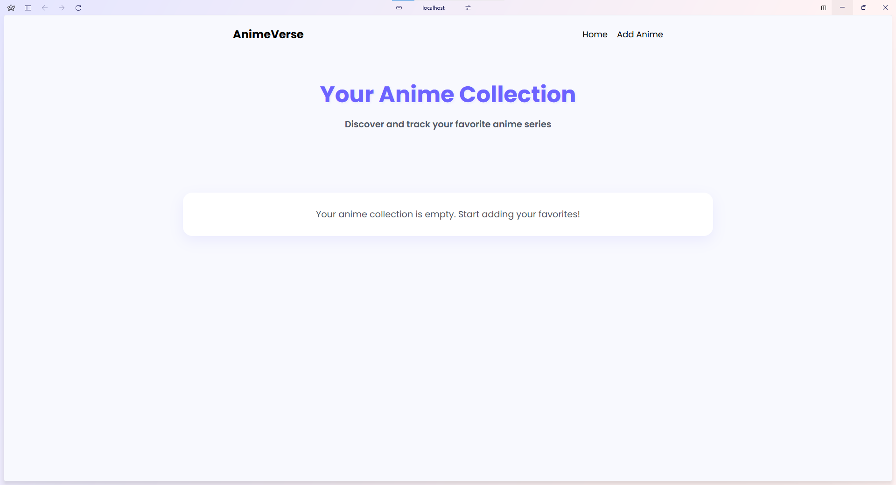
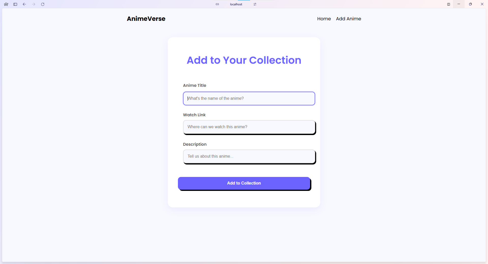
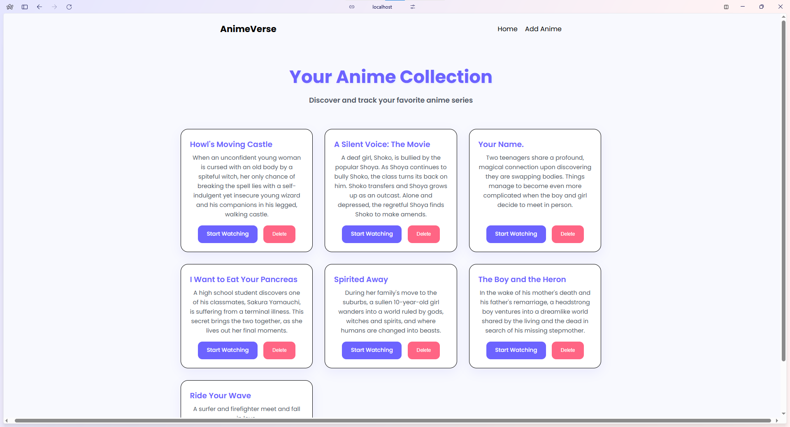

# AnimeVerse - Your Personal Anime Collection

AnimeVerse is a full-stack web application that allows users to create and manage their personal anime watchlist. Built with the MERN stack (MongoDB, Express.js, React, Node.js) and Docker, it provides a modern, responsive interface for anime enthusiasts to track their favorite series.


*Home page showing an empty collection with a welcoming message*


*Add new anime to your collection with a clean, user-friendly form*


*Home page displaying a curated collection of anime with watch links*

## Features

- 📝 Create and manage your anime collection
- 🔗 Add watch links for easy access
- 🎨 Modern, responsive UI with smooth animations
- 🗑️ Delete entries from your collection
- 🐳 Dockerized for easy deployment
- 🔄 Real-time updates

## Tech Stack

### Frontend
- React.js
- Vite
- Axios for API calls
- Modern CSS with CSS variables
- Responsive design

### Backend
- Node.js
- Express.js
- MongoDB with Mongoose
- RESTful API architecture

### DevOps
- Docker
- Docker Compose
- Environment variables for configuration

## Prerequisites

- Node.js (v14 or higher)
- Docker and Docker Compose
- MongoDB (if running without Docker)

## Installation

1. Clone the repository:
```bash
git clone https://github.com/yourusername/anime-watchlist-mern-docker.git
cd anime-watchlist-mern-docker
```

2. Create environment files:
   - Create `.env` in the root directory
   - Create `.env` in the frontend directory with `VITE_API_URL=http://localhost:8000`

3. Start the application using Docker:
```bash
docker compose up --build
```

The application will be available at:
- Frontend: http://localhost:5173
- Backend: http://localhost:8000

## Development

### Running without Docker

1. Start the backend:
```bash
cd backend
npm install
npm start
```

2. Start the frontend:
```bash
cd frontend
npm install
npm run dev
```

## API Endpoints

- `GET /api/anime` - Get all anime entries
- `POST /api/anime` - Create a new anime entry
- `DELETE /api/anime/:id` - Delete an anime entry

## Project Structure

```
anime-watchlist-mern-docker/
├── frontend/               # React frontend
│   ├── src/
│   │   ├── pages/         # React components
│   │   ├── App.jsx        # Main app component
│   │   └── index.css      # Global styles
│   └── Dockerfile         # Frontend Docker configuration
├── backend/               # Express backend
│   ├── database/         # MongoDB models
│   ├── index.js          # Main server file
│   └── Dockerfile        # Backend Docker configuration
└── compose.yaml          # Docker Compose configuration
```

## Contributing

1. Fork the repository
2. Create your feature branch (`git checkout -b feature/AmazingFeature`)
3. Commit your changes (`git commit -m 'Add some AmazingFeature'`)
4. Push to the branch (`git push origin feature/AmazingFeature`)
5. Open a Pull Request

## License

This project is licensed under the MIT License - see the [LICENSE](LICENSE) file for details.

## Acknowledgments

- Built with ❤️ using the MERN stack
- Inspired by the need for a simple anime tracking solution
- Thanks to all contributors and users of the application 